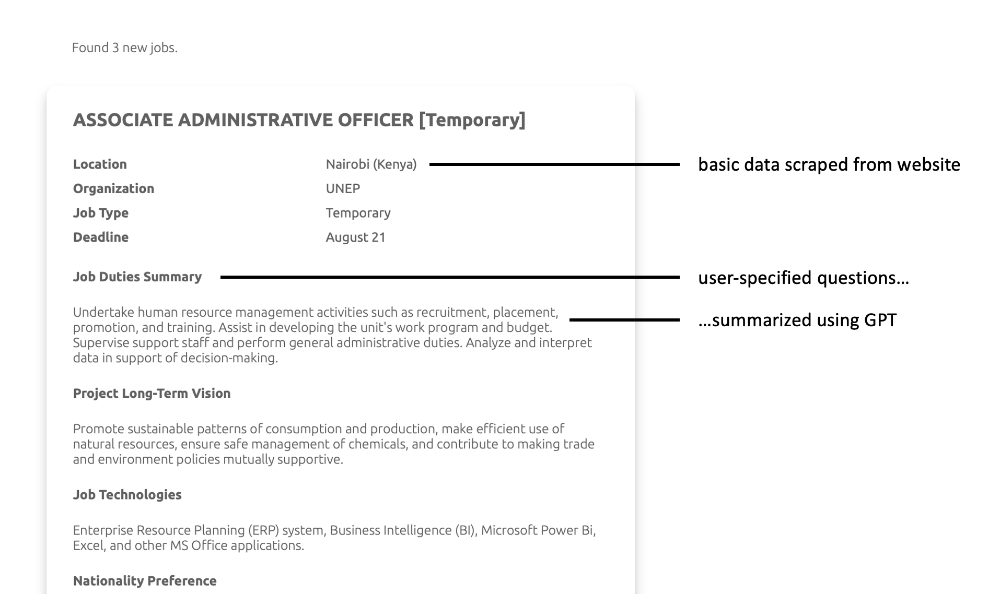

# UNJobReporter - Automated UN Job Analysis and Reporting

UNJobReporter is a Python tool designed to streamline the process of gathering and analyzing United Nations job postings from [UNJobNet](https://www.unjobnet.org). It automates the extraction of job descriptions, filters job listings, and provides answers to custom queries about these listings using OpenAI's GPT-3.5. The tool then sends the compiled information to a designated email address.

You may run this tool on a schedule to receive regular reports about UN job postings.



## Installation

To get started with UNJobReporter, follow these installation steps:

1. Install the required dependencies using pip:
   ```
   pip install -r requirements.txt
   ```

2. You will need Google Chrome and the Chrome WebDriver for [Selenium](https://pypi.org/project/selenium/). Download the appropriate WebDriver version from [here](https://googlechromelabs.github.io/chrome-for-testing/) and ensure it's in your system's PATH. Selenium is used for scraping the descriptions of most IOM jobs.

## Setup

Before using UNJobReporter, you need to set up various configurations:

1. **Configure Email Sending**:
   Set up your email sending using [Resend](https://resend.com/overview).

2. **Get API Keys**:
   Obtain API keys for both OpenAI and Resend. Store these keys in a `.env` file along with your sender email address. Here is a sample `.env` file:
    ```
    RESEND_API_KEY=<your-resend-api-key>
    OPENAI_API_KEY=<your-openai-api-key>
    SENDER_EMAIL="Job Notifications <job-notifications@somedomain.com>"
    ```

3. **Use the Setup Script (setup_user.py)**:
   Run the setup script to create a custom configuration for your reporting needs. The script will prompt you for the following information:
   - Search URLs for UNJobNet. Make sure the search is sorted by the most recent postings and starts from page 1. Here is an [example](https://www.unjobnet.org/jobs?occupations%5B0%5D=6&levels%5B0%5D=Entry+Professional&keywords=&locations%5B0%5D=&orderby=recent&page=1).
   - Custom questions you want to ask about the job descriptions. See below for examples.
   - Continents you want to filter job listings for. Jobs on the continents you specify here will be filtered out. You need to specify the continent using its [continent code](https://country-code.cl).
   - The email address where you want to receive the generated reports.

   The setup script will generate a configuration file that you'll need to pass to the main script.

### Sample Questions

Here are some example questions you can use to guide your custom queries:

- _Summarize the job duties and the broader context of the job in two sentences. Do not repeat the job title or otherwise name the job, e.g. start your sentence with the verb._
- _What is the long-term vision for the project this job relates to?_
- _Which technologies are used in this job?_
- _Are certain nationalities preferred?_
- _What are the language requirements of this job?_
- _How many years of experience are required?_

## Usage

Once you've completed the setup, you can start using UNJobReporter:

1. Run the main script `main.py` and provide the generated configuration file as an argument:
   ```
   python main.py path/to/your/config/file.json
   ```

The script will automatically scrape job postings, analyze descriptions, and generate customized reports based on your predefined questions. The reports will be sent to your specified email address.

To ensure you are not seeing the same jobs twice, the script saves the IDs of jobs in a csv file.